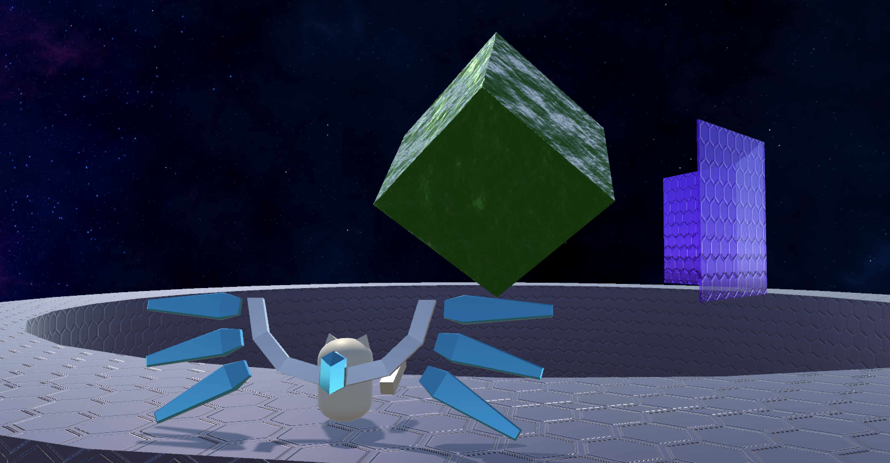
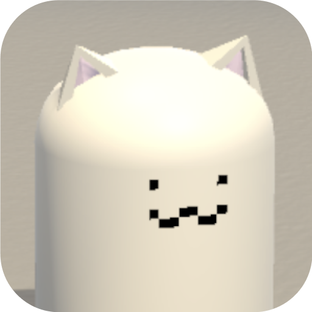

# Capsule Cat's Big Space Adventure

## What is CCBSA?

Capsule Cat's Big Space Adventure is a 3rd person arcade shooter, inspired by old-school shoot-em-ups.

You play as Capsule Cat, our cute low-poly hero.
Equipped with a high tech energy pack, Capsule cat progresses from stage to stage to shoot down space cubes. 
Between stages, have a rest and upgrade your stats at the shop!

Watch out, the space cubes aren't defenseless. With tough shields, projectiles, and giant lasers to protect themselves, you must dodge and fight back! How far can you progress before Capsule Cat is shot down?

This game was made for CS50G as a Final Project and was developed with Unity 2021.3.13f1.

## Features
### 1. Multiple game states

The game features the following states/scenes:
- Start Screen
- Battle State
- Victory Screen
- Rest Area
- Shop
- Game Over Screen

### 2. Infinite procedurally generated levels with scaling difficulty

Levels start easy, but the following scale as the player progresses through stages:
- Enemy shield quantity and hit points (arrangement pattern of shields is also procedural)
- Enemy shield movement speed (with upper limit)
- Enemy attack speed (with upper limit)
- Enemy attack power

### 3. Risk vs Reward energy system

- Players have a limited pool of energy which reduces with each bullet fired during a battle.
- If a player's energy reaches zero, their bullets will become much slower and weaker.
- To replenish energy during a battle, a player must touch enemy projectiles/lasers with the wings on Capsule Cat's backpack. This means that they'll have to stay close to the enemy's attacks, but not too close!

### 4. Player upgrades with in-game points/currency system

After completing each stage, players are awarded some in-game money. This money can be used in the rest area between stages to purchase upgrades for:

- Maximum Hit Points
- How much HP can be recovered between stages
- Firing rate
- Maximum energy amount
- Energy replenishment rate

Players must make decisions on how to best prepare for the increasing stage difficulty with their limited money.

### 5. Scoring System
If a player's HP reaches zero, it's Game Over. Players must try to clear as many stages as possible.

My high score is 17 stages completed btw just saying

### 6. Animated Scene Transitions
Using Unity's animation system, slick wipe transitions have been placed when players transition between scenes in game.

## Design Elements/Considerations
### 1. Event-based triggers

In order to reduce the number of checks done each frame update, many triggers such as a bullet hitting an enemy/the player to update HP fields, or the enemy/player's HP reaching zero to transition to the victory/game over state, have been implemented using events and listeners instead.

### 2. Object pooling

Players and enemies can fire out many projectiles over the course of a battle. To avoid having to constantly allocate/deallocate memory for creating/destroying new projectiles, the object pooling pattern was implemented.

At the start of each battle, a sufficiently-sized list of each object(bullets, lasers) is created. Whenever one of these objects needs to be instantiated (e.g. a player presses the shoot button), an already existing object from the object pool is referenced and set to active instead. When one of these objects needs to be destroyed, they are simply set as inactive and returned to the pool, ready to be used again.

The pool is dynamic, meaning that if at any point there needs to be more active objects than there are objects in the pool, more are allocated.

### 3. Reuseable component-based behaviour
To reduce repeated code for each specific object behaviour, component scripts such as Damageable were created be added to gameobjects, allowing for modular game creation.

Some examples:
- Damageable can be added to any object that can take damage, such as the player, enemy bodies, enemy shields. This class is also extended to create the DamageAbsorber script for the player's wings.
- IdleRotation can be added to any object to make it spin constantly.
- HitBoxTrigger can be added to any object with a collider to send out events to other scripts when the collider is triggered.

## Credits
Music by [lemonmusicstudio](https://pixabay.com/users/lemonmusicstudio-14942887/) on Pixabay.

Skyboxes by [Avionx](https://assetstore.unity.com/packages/2d/textures-materials/sky/skybox-series-free-103633) on the Unity Asset Store.

3rd person controller from starter assets by Unity.

All in-game models were made by myself in Unity.

All other sound effects, sprites and texture maps were made by myself. Normal maps were converted using [NormalMap Online](https://cpetry.github.io/NormalMap-Online/).

## Roadmap
### Add Local Multiplayer
- Allow 2 players to play on the same computer and run into a lot of conflicts during movement

### Add Automated Unit Testing on merge request
- [test runner action](https://github.com/marketplace/actions/unity-test-runner)
    - [yaml syntax](https://learnxinyminutes.com/docs/yaml/)
    - [github workflow syntax](https://docs.github.com/en/actions/using-workflows/workflow-syntax-for-github-actions#about-yaml-syntax-for-workflows)
- [test runner docs](https://game.ci/docs/github/test-runner)
- [code coverage](https://docs.unity3d.com/Packages/com.unity.testtools.codecoverage@1.2/manual/index.html)
